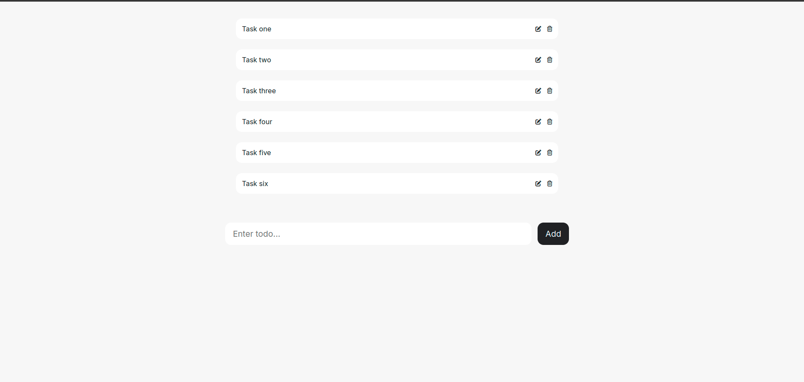

<h1 align="center">Todo React</h1>

### 🛠 Technologies

The following tools were used in building the project:
- [React](https://react.dev/)
- [Typescript](https://www.typescriptlang.org/)
- [Docker](https://www.docker.com/)

## Project Description
<p>
This is a simple To-Do List application built with React. Users can add new tasks, edit existing ones, and delete them as needed. The task list is saved in localStorage, ensuring persistence even after the page is reloaded.
</p>

The project is deployed in Vercel.
<br />
https://react-todolist-red-ten.vercel.app/
<br />
<br />

## General Information
<h3 align="center">Demo</h3>
<h1 align="center">
  
</h1>

### 🎲 Running

```bash
# up docker containers:
$ tusk up
$ make up
$ docker compose up -d

# enter in node container:
$ tusk node bash
$ make node bash
$ docker compose exec node bash

# install the dependencies
$ npm run install

# Run the application in development mode
$ npm run dev

# The api server will start on the port configured (default 3000) - access <http://localhost:3000>
```